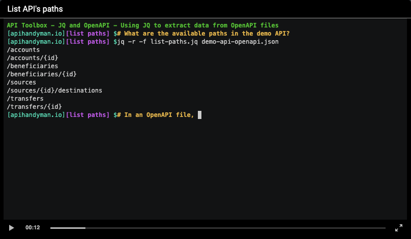

# The apihandyman.io website

The [API Handyman blog](http://apihandyman.io) uses [Jekyll](https://jekyllrb.com/) and [Github pages](https://pages.github.com/) among other things.

# Install and run

The `Jekyll Serve` serve task defined in `.vscode/tasks.json` starts when the repo folder is opened in VS Code. It creates the necessary docker image and starts it. Open `http://localhost:4000`

```
git clone https://github.com/arno-di-loreto/apihandyman.io
code apihandyman.io
```

# Writing

## Creating a new post

To create a new post, use the "New Post" VS Code task:

- Open VS Code command palette (command-shit-p)
- Run task
- New Post
- Set title
- Choose a category
- Set a publish date

This will create:

- post branch
- md file in `_posts`
- images directory in `images`

Note: Post banner and thumbnail are the same image (`images/<post directory>/banner.png` or `images/<post directory>/banner.jpg`).

## Set excerpt

```
This text will be shown on posts list.
<!--more-->
But not this one
```

## Images

Images are located in `images/<post url>`directory, you only need the relative filename to include them:

```

```

## Quotes

```

```

## HTTP Status Codes

HTTP Status Codes information can be embedded using the following styles:

- `quote`: All data as a quote
- `rfc`: RFC number (RFC XXXX)
- `rfcname`: RFC number and name
- `rfcfull`: RFC number, name and url
- `code`: Code only
- `reason`: Reason only
- If no style is provided, the value is code and reason

```

```

HTTP status code data are defined in `_data/http-status-codes.yaml` and RFC data are defined in `_data/rfcs.yaml`. 

## Code blocks

Code blocks look like this:


What the toolbar buttons do (from left to right):

- The first button (double arrow) is for expanding/shrinking the code block content.
- The second button (file icon) opens the file which is shown in code block (when using `codefile`)
- The third one copy the code block content (that can be simplified) to clip board

### Inline code blocks

```

some code

```

Parameters:

- title (optional): the block title
- language (mandatory): the language used
- numbers (optional): showing line numbers or not (true by default)
- highlight (optional): a set of line index (`1`) or range (`3-4`) separated by `,` to highlight

#### Inline code block with lines highlighted


```

some: inline
code: which
will: be
hightlighted: by prism

```

#### Inline code block with customized copy

What is below `{{site.codeblock_hidden_copy_separator}}` will be copied.

```


[apihandyman.io] $jq '.info.contact' demo-api-openapi.json
{
  "name": "The Banking API team",
  "email": "api@bankingcompany.com",
  "url": "developer.bankingcompany.com"
}
[apihandyman.io] $jq '.info.contact = { name: "The Awesome Banking API Team", url: "www.bankingcompany.com" }' demo-api-openapi.json | jq '.info.contact'
{
  "name": "The Awesome Banking API Team",
  "url": "www.bankingcompany.com"
}

{{site.codeblock_hidden_copy_separator}}

jq '.info.contact' demo-api-openapi.json
jq '.info.contact = { name: "The Awesome Banking API Team", url: "www.bankingcompany.com" }' demo-api-openapi.json | jq '.info.contact'


```

### File code block

Instead of writing code block inline, a file can be included:

```

```

Parameters:

- filename (mandatory): the file to include (Files are searched in `code/<post url>` folder if no folder is specified in `file`.)
- title (optional): the block title (Use `$filename` to set title to the actual filename)
- language (mandatory): the language used
- numbers (optional): showing line numbers or not (true by default)
- highlight (optional): a set of line index (`1`) or range (`3-4`) separated by `,` to highlight


## Asciinema

Check my [AscriiptnemA](https://github.com/arno-di-loreto/ascriiptnema) tool to easily record pre-scripted bash sessions using [asciinema](https://asciinema.org/).



```

```

## Videos

Add following data in `_data/thirdpartycontents.yaml`:

```
the-augmented-api-design-reviewer-asc:
  source: youtube
  id: MAHW5DmM9j4
  preview: /images/thirdpartycontents/the-augmented-api-design-reviewer-asc.jpg
```

Then use the following code to include it in a post:

```

```

## Slide decks

Slide decks files are located in `slidedecks` folder.

```
slidedecks
├── a-quest-for-simplicity
│   ├── a-quest-for-simplicity.pdf
│   ├── index.html
│   └── slides
│       ├── slide-001.png
│       ├── slide-002.png
```

They can be included in a post with:

```

```

## Publishing

Publishing is done automatically by the Publish action (`.github/workflows/publish.yml`) when merging/pushing on the main branch. This action does the following:

- Cloning the repo
- Launching Jekyll build using docker
- Pushing the build to gh-pages
- Cleaning Cloudflare cache