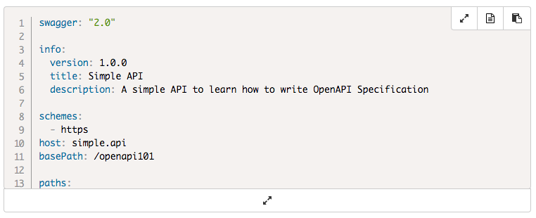

# The apihandyman.io website 

The [API Handyman blog](http://apihandyman.io) uses [Jekyll](https://jekyllrb.com/) and [Github pages](https://pages.github.com/) among other things.

This readme files explains a few things about how this website is coded, build and deploy.

# Install and run

## Install Jekyll

```
gem install jekyll bundler
```

## Clone repo and install

```
git clone https://github.com/arno-di-loreto/apihandyman.io
cd apihandyman.io
bundle install
```

## Run

```
bundle exec jekyll serve
```
# Writing


## Creating a new post

To create a new post:

```
scripts/post.sh "<title>" <optional:category, posts|talks|elsewhere, default: posts> <optional:date, YYYY-MM-DD>
```

Examples:

```
scripts/post.sh "Your Awesome Title" talks 2017-09-23
scripts/post.sh "Your Awesome Title" talks
scripts/post.sh "Your Awesome Title"
```

The script will create:

- post branch
- md file in `_posts`
- images directory in `images`

Post banner and thumbnail are the same image (`images/<post directory>/thumbnail.png`).

## Set excerpt

```
This text will be shown on posts list.<!--more-->
But not this one
```

## Images

Images are located in `images/<post url>`directory, you only need the relative filename to include them:

```

```

You can add a label to image:

```

```

## Embed Tweets

Grab the tweet URL and you're done:

```

```

## Code blocks

Code blocks look like this:



What the toolbar buttons do (from left to right):

- the first button (double arrow) is for expanding/shrinking the code block content. This button also appear at the code block's bottom
- the second button (file icon) opens the file which is shown in code block (when using `codefile`)
- the third one copy the code block content to clip board

## Youtube and Vimeo Videos

Grab Youtube video id (https://youtu.be/8Q0Yu81rRmU) or Vimeo video id (https://vimeo.com/237468064) and use the appropriate plugin:

```


```

## Speakerdeck Slidedecks

Grab slide deck ID from speakerdeck (`data-id` in the embed code you get on speakerdeck.com when clicking on the `embed` link):

```

```

### Inline code

Highlight code between `code` and `endcode`.

```

some: inline
code: which
will: be
hightlighted: by prism

```

Parameters:

- language (mandatory): the language used
- numbers (optional): showing line numbers or not (true by default)
- highlight (optional): a set of line index (`1`) or range (`3-4`) separated by `,` to highlight

### Code from file

Include a code file and highlight it.

```

```

# Deployment on Github pages with Travis

Each commit to github repo triggers deployment to `gh-pages` branch.
But, as this website uses custom Jekyll plugins it can't be deployed automatically by [Github Page](https://pages.github.com/), I'm using [Travis CI](https://travis-ci.org/) to handle that.

## Build
On each commit on the master branch, travis builds the website using `scripts/build.sh` as defined in `.travis.yml` configuration.

```
env:
  global:
    - JEKYLL_ENV=production

script: scripts/build.sh
```

This script is mainly used to be sure I do not forget to define JEKYLL_ENV variable which is used to include or not Google Analytics and Disqus scripts in the pages.

## Deploy
If the build is OK, Travis deploys it the `gh-pages` branche of with `scripts/deploy.sh`.

This scripts uses some environment variables:

- DEPLOY_REPO (optional, default: current repo): The repos where the build should be deployed
- DEPLOY_BRANCH (required): The branch where the build should be deployed
- BUILD_TARGET (optional, default: _site): Where is the result of the build
- DEPLOY_TARGET (optional, default: .deploy): Where should be cloned the targeted branch
- GH_TOKEN (optional but needed when running on travis ci): A [github access token](https://help.github.com/articles/creating-an-access-token-for-command-line-use/)
- GH_USER (optional but needed when running on travis ci): A github username needed to do the git push
- GH_EMAIL (optional but needed when running on travis ci): A github email needed to do the git push 
- PUBLISH_MESSAGE (optional, default: publish): The commit message

Travis configuration in .travis.yml:

```
env:
  global:
    - DEPLOY_BRANCH=gh-pages

deploy:
  provider: script
  skip_cleanup: true
  script: scripts/deploy.sh
  on:
    branch: master
```

Note the `skip_cleanup: true` which allow to keep the site generated in `_site` by the build.

The GH_TOKEN, GH_USER and GH_EMAIL used by Travis are defined on the Travis website with hidden env variables for the repo.

# About some features

## Links on H1, H2, H3 sections
To have a link appearing on H1, H2, H3 sections, you need to use [Anchor JS](http://bryanbraun.github.io/anchorjs/).

- add `anchor.min.js` to page `head` (see `_includes/head.html`)
```
<head>
...
<script type="text/javascript" src="{{ "/js/anchor.min.js" | prepend: site.baseurl | prepend: site.github.url }}" ></script>
</head>
```
- define wich items should be handle by Anchor JS (see `_layouts/post.html`)
```
<script language="JavaScript">
    anchors.options = {
      placement: 'left'
    };
    anchors.add('.blog-container h1');
    anchors.add('.blog-container h2');
    anchors.add('.blog-container h3');
</script>
```

## Dynamic TOC on posts
The dynamic TOC is handled by [Bootstrap TOC](https://afeld.github.io/bootstrap-toc/)

- add CSS and JS in head (see `_includes/head.html`)
```
<head>
...
<link rel="stylesheet" href="{{ "/css/bootstrap-toc.min.css" | prepend: site.baseurl | prepend: site.github.url }}">
...
<script type="text/javascript" src="{{ "/js/bootstrap-toc.min.js" | prepend: site.baseurl | prepend: site.github.url }}" ></script>
...
</head>
```

- define a nav item (see `_layouts/post.html`)
```
<nav id="toc" data-spy="affix" data-offset-top="400"></nav>
```

- add some javascript to populate the `#toc`, here we only retrieve the elements which are in the `#posts` div
```
<script language="javascript">
  $(function() {
    var $myNav = $('#toc');
    var $myScope = $('#post');
    Toc.init({
      $nav: $myNav,
      $scope: $myScope
    });
    $('body').scrollspy({
      target: '#toc'
    });
  });
</script>
``` 

- the TOC scrolling is handled thanks to the bootstrap affix class which is slighly customized to handle the 50px top nav bar
```
.affix {
  top:50px;
  position:fixed;
}
```

## Infinite pagination on home and categories pages 

By default, jekyll return all posts on home page and categories pages. It's not really efficient. Fortunately it's possible to get an infinite pagination by using two jekyll plugins and a little bit of javascript.

### Pagination on home page

Activating pagination on home page is fairly easy, you just have to follow the [instructions provided in Jekyll Documentation](https://jekyllrb.com/docs/pagination/).

- include jekyll-paginate plugin in Gemfile:
```
group :jekyll_plugins do
  [... other gems ...]
  gem "jekyll-paginate"
end
```
- download the added dependancy with this command line
```
bundle install
```
- include jekyll-paginate plugin _config.yml gems:
```
gems:
[... other gems ...]
- jekyll-paginate
```
- set pagination configuration in _config.yml
```
# number of items per page
paginate: 5
# page folder's name template
# you'll get something like http://myblog.com/page3/
paginate_path: "page:num"
```
- update your home template like this to loop on paginated posts (note that your home page MUST be an .html file and not a .md one):
```

  

```

### Pagination on categories

But it works only for ALL posts, if you want to have pagination for categories page, you have to use another plugin [Jekyll Paginate Category Plugin](https://github.com/midnightSuyama/jekyll-paginate-category).

- include jekyll-paginate-category plugin in Gemfile:
```
group :jekyll_plugins do
  [... other gems ...]
  gem "jekyll-paginate-category"
end
```
- download the added dependancy with this command line
```
bundle install
```
- include jekyll-paginate-category plugin _config.yml gems:
```
gems:
[... other gems ...]
- jekyll-paginate-category
```
- set category pagination configuration in _config.yml
```
# folder where categories pages will be generated
# you'll get something like http://myblog.com/categories/mycategory/page3/
category_dir: "categories"
# layouts used for each page
category_layout: "_layouts/category.html"
```
- update your home template like this to loop on paginated posts:
```

  



  

```

Note that it's almost the same thing as seen with jekyll-paginate, you can use exactly the same layout for all posts and categories, take a look at `_layout/paginated.html` which is used by `index.html` (all posts) and `_layouts/paginated.html` (categories) in this repository.

The bonus thing is that the plugin generates all categories pages without doing anything.

### Categories parameters

I needed to define some value specific to each category (a subtitle), I've define these value in the `_data/categories.yml` file.
These values are used in `_includes/header.html`:
```

  ...
  

```

### Pagination controls

To add infinite scroll we need to have a next link in the page to load the next page.
Pagination controls are defined within `_includes/pagination.html` which provides two types of controls:

- simple next/previous buttons
- next/previous and page numbers

Once infinite scroll is activated, these controls are hidden.

### Infinite scroll

Infinite scrool is handled by some javascript in `js/infinitescroll.js`, this script is adapted from this [post](https://blog.codestack.de/2015/05/17/seo-friendly-infinite-scroll.html).

The principle is:

- to trigger next page loading once the scroll is near the end of the current page
- the next page's URL is retrieved from the `#next` link
- once the next page is load is `#main` div content is added to the current `#main` div

## Code blocks

This website uses two custom jekyll plugins to highlight code:

- _plugins/codefilehighlight.rb (`codefile`) to highlight included code files
- _plugins/codehighlight.rb (`code`) to highlight inline code

### Tools used

- Code blocks are styled with [Prism](http://prismjs.com/)
- the top left and bottom toolbars are created using bootstrap
- the copy button use [ClipboardJS](https://clipboardjs.com/)
- and there's also some CSS/JavaScript/JQuery

### General configuration

Both plugins use configuration in `_config.yml`:

```
## code highlight
### disabling default code highlighter
highlighter: none
### codefilehighlight parameter: where code files are stored
coderoot: code
### codefilehighlight parameter: number of visible lines in code block
codeblocksize: 20
```

### Prism configuration

The `css/prism.css` and `js/prism.js`are generated with the [Prism download page](http://prismjs.com/download.html) which allow you to choose exactly what you need.

My configuration:

- Theme:
  - Default
- Languages:
  - Markup
  - C-Like
  - JavaScript
  - Bash
  - GraphQL
  - JSON
  - SQL
  - YAML
- Plugins:
  - Line highlight
  - Line numbers


# All tools used by apihandyman.io

Here's the list of tools used:

- [Bootstrap](https://getbootstrap.com/) to build easily a responsive website
- [Bootstrap TOC](https://afeld.github.io/bootstrap-toc/) for dynamic TOC sidebar on posts
- [Anchor JS](http://bryanbraun.github.io/anchorjs/) to add links on H1, H2, H3 sections titles on posts
- [Font Awesome](http://fontawesome.io/) for social links in footer
- [Jekyll](https://jekyllrb.com/) to build the static website
- [Jekyll Paginate Category Plugin](https://github.com/midnightSuyama/jekyll-paginate-category) for pagination on categories pages
- [Jekyll Twitter Plugin](https://github.com/rob-murray/jekyll-twitter-plugin) to embed tweets easily
- [Github Page](https://pages.github.com/) to host the generate static website
- [Travis CI](https://travis-ci.org/) to build and deploy the static website
- [Prism](http://prismjs.com/) to highlight code blocks
- [ClipboardJS](https://clipboardjs.com/) for copy button on code blocks
